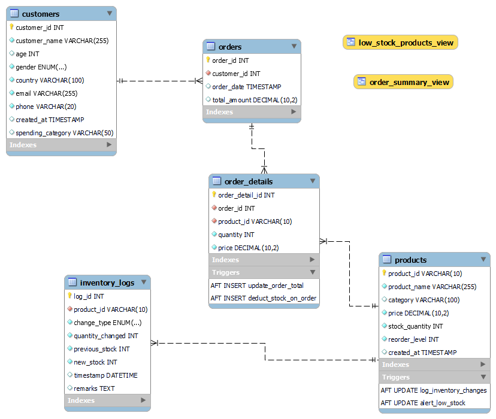

# Inventory and Order Management System

## Overview

This project implements a database-driven system to manage inventory and orders for an e-commerce company. It efficiently handles product information, customer data, and order processing while ensuring that stock levels are properly updated when orders are placed. The system also tracks all inventory changes and streamlines processes related to stock replenishment.

The goal is to provide insights into customer purchase behaviors, monitor stock levels, and ensure that products are always available for sale, minimizing manual work and ensuring accuracy in inventory tracking and order management.

## Problem Statement

This system addresses the need for an efficient way to manage inventory and orders for an e-commerce company. It aims to solve challenges related to tracking product information, managing customer data, processing orders, updating stock levels, and monitoring inventory changes. The system also provides insights into customer spending habits and helps streamline stock replenishment processes.

## Key Features

* **Database Schema:** A well-designed database schema to store information about products, customers, orders, order details, and inventory logs.
* **Order Placement:** Efficient processing of new customer orders, including deducting stock and calculating total amounts.
* **Inventory Management:** Real-time tracking of stock levels and automatic updates upon order placement.
* **Inventory Logging:** Comprehensive logging of all inventory changes (orders, restocks, adjustments) for auditing.
* **Stock Replenishment:** Mechanisms to identify low stock products and facilitate the replenishment process.
* **Business Insights:** Generation of summaries and reports on orders and stock levels.
* **Customer Insights:** Categorization of customers based on spending habits and implementation of bulk discounts.
* **Automated Processes:** Automation of key tasks like stock updates, order total calculations, and customer categorization.
* **Data Access Simplification:** Use of database views to provide simplified access to summarized order and stock information.


# Project File Structure
AMALITECH_LABS/             # Root directory for the AMALITECH LABS project
└── inventory_system/       # Main directory for the inventory management system
├── deliverables/       # Contains the project's deliverables
│   ├── database_schema/ # SQL scripts and related files for defining the database schema
│   │   ├── schema.png    # Image representing the database schema
│   │   └── schema.sql    # SQL file to create the tables and define the database structure
│   ├── report_summaries/ # SQL scripts for generating report summaries
│   │   ├── order_summary_report.sql # SQL query to generate a report on order summaries
│   │   └── stock_insights_report.sql # SQL query to generate a report on stock insights
│   ├── replenishment_system/ # Files related to the stock replenishment system
│   │   ├── categorise_customers.sql # SQL script to categorize customers based on spending
│   │   └── replenish_stock.sql      # SQL script for the replenish_stock stored procedure
│   ├── sql_queries/      # SQL scripts for specific queries
│   │   ├── insert_order_details.sql # SQL script to insert order details
│   │   └── insert_order.sql         # SQL script to insert a new order
│   ├── triggers/         # SQL scripts for defining database triggers
│   │   └── alert_low_stock.sql # SQL script for a trigger to alert when stock is low
│   │   └── deduct_stock_on_order.sql # SQL script for a trigger to deduct stock when an order is placed
│   │   └── log_inventory_changes.sql # SQL script for a trigger to log inventory changes
│   │   └── update_order_total.sql # SQL script for a trigger to update the total amount of an order
│   └── views/          # SQL scripts for creating database views
│       └── low_stock_products_view.sql # SQL script to create a view for low stock products
│       └── order_summary_view.sql    # SQL script to create a view for summarizing order information
├── tests/              # Directory containing test scripts and utility functions
│   ├── pycache/     # Python cache directory (usually automatically generated)
│   ├── main.py           # Likely the main test execution script
│   ├── test_categorize_customers.py # Python script to test the customer categorization functionality
│   ├── test_low_stock_products_view.py # Python script to test the low stock products view
│   ├── test_order_summary_report.py # Python script to test the order summary report
│   ├── test_order_summary_view.py    # Python script to test the order summary view
│   ├── test_place_order.py           # Python script to test the order placement functionality
│   ├── test_replenish_stock.py       # Python script to test the stock replenishment functionality
│   ├── test_schema.py              # Python script to test the database schema creation
│   ├── test_stock_insights_report.py # Python script to test the stock insights report
│   └── utility.py                    # Python script containing utility functions (e.g., database connection, SQL execution)
├── .env                    # File to store environment variables (e.g., database credentials)
├── .gitignore              # Specifies intentionally untracked files that Git should ignore
├── my_env3/                # Virtual environment directory containing the project's Python dependencies
├── README.md                   # Provides an overview and instructions for the project
└── requirements.txt            # Lists the Python package dependencies required for the project


## Getting Started

### Prerequisites

* **MySQL Server:** You need a running MySQL server instance to host the database.
* **Python 3:** Python 3 is required to run any potential scripts interacting with the database.
* **MySQL Connector/Python:** This library is used to connect Python applications to the MySQL database.

### Installation

1.  **Clone the repository** (if applicable) or create the project directory.
2.  **Install Dependencies:** Navigate to the project directory in your terminal and install the required Python packages using pip:

    ```bash
    pip install -r requirements.txt
    ```

    The `requirements.txt` file for this project includes:

    ```txt
    dotenv==0.9.9
    mysql-connector-python==9.3.0
    mysqlclient==2.2.7
    python-dotenv==1.1.0
    ```

    While `mysqlclient` is listed, the code primarily uses `mysql-connector-python`.

3.  **Database Setup:**
    * Connect to your MySQL server using a MySQL client.
    * Create a new database for the inventory system (if you haven't already).
    * Execute the SQL scripts located in the `deliverables/database_schema` directory (specifically `schema.sql`) to create the necessary tables and define the schema.
    * your schema should look like this
    

## Using `utility.py` for Inventory and Order Management

These instructions outline how to use the `utility.py` script (which provides database utility functions) along with separate Python scripts to perform the tasks for the Inventory and Order Management System project.

### Prerequisites

1.  **Python Installed:** Ensure you have Python installed on your system. You can download it from [https://www.python.org/downloads/](https://www.python.org/downloads/).
2.  **.env File Setup:**
    * Create a file named `.env` in the root directory of your project (where `utility.py` is located).
    * Add your MySQL database connection details to this file using the following format:

        ```
        DB_HOST=your_database_host
        DB_USER=your_database_user
        DB_PASSWORD=your_database_password
        DB_DATABASE=your_database_name
        ```

        Replace `your_database_host`, `your_database_user`, `your_database_password`, and `your_database_name` with your actual database credentials.


### Phase 1: Database Design and Schema Implementation

1.  **Database Schema:** The `schema.sql` file in the `deliverables/database_schema` directory contains the SQL statements to create the necessary tables.


2.  **Locate the Test Script:** Locate the Python file `tests/test_schema.py` to execute the schema script.
    **Note:** Adjust the `schema_path` to the correct relative path in your project.


3.  **Run the Test Script:** Execute the test script from your terminal:

    ```bash
    python tests/test_schema.py
    ```


### Phase 2: Order Placement and Inventory Management

1.  **Run the Order Placement Test Script:** Execute your `test_place_order.py` script from the terminal:

    ```bash
    python tests/test_place_order.py
    ```


### Phase 3: Monitoring and Reporting

1.   **Run the Order Summary Report Test Script:**

    ```bash
    python tests/test_order_summary_report.py
    ```

2. **Run the Stock Insights Report Test Script:**
     **Note:** Ensure the `report_script_path` points to your `stock_insights_report.sql` file.

    ```bash
    python tests/test_stock_insights_report.py
    ```

3. **Run the Categorise Customers Test Script:**

    ```bash
    python tests/test_categorize_customers.py
    ```  


### Phase 4: Stock Replenishment and Automation

1. **Run the Stock Replenishment Test Script:** 

   ```bash
    python tests/test_replenish_stock.py
    ``` 

2.  **Automate Processes:** 
    Run the main script that calls these test functions.

    
   ```bash
    python tests/main.py
    ``` 

    To automate this script to run at desired intervals (e.g., daily, weekly), you can use system scheduling tools:

    * **Cron (Linux/macOS):** You can set up a cron job to run the `python main.py` command at specific times and dates.
    * **Task Scheduler (Windows):** You can create a scheduled task to run the `python main.py` command at your desired schedule.

    You would configure these tools to execute the Python script using the `python` interpreter. Make sure the script has the necessary permissions to run.

### Phase 5: Advanced Queries and Optimizations

1.  **Create Views:** 
Run (`test_order_summary_view.py`, `test_low_stock_products_view.py`) to execute the SQL scripts for creating views located in the `deliverables/views`
